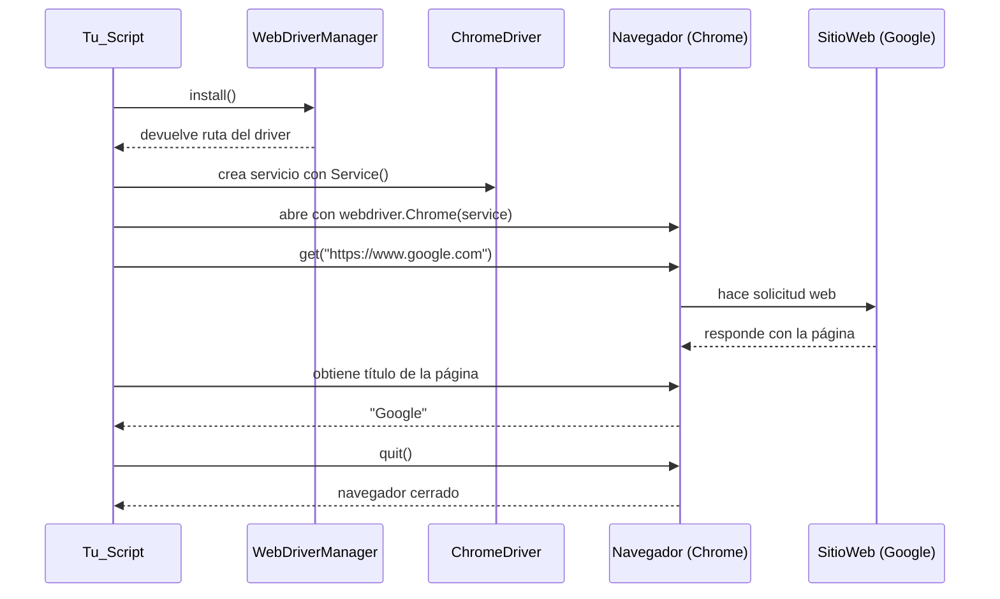

```mermaid
sequenceDiagram
    participant Tu_Script
    participant WebDriverManager
    participant ChromeDriver
    participant Navegador (Chrome)
    participant SitioWeb (Google)

    Tu_Script->>WebDriverManager: install()
    WebDriverManager-->>Tu_Script: devuelve ruta del driver

    Tu_Script->>ChromeDriver: crea servicio con Service()
    Tu_Script->>Navegador (Chrome): abre con webdriver.Chrome(service)

    Tu_Script->>Navegador (Chrome): get("https://www.google.com")
    Navegador (Chrome)->>SitioWeb (Google): hace solicitud web
    SitioWeb (Google)-->>Navegador (Chrome): responde con la página

    Tu_Script->>Navegador (Chrome): obtiene título de la página
    Navegador (Chrome)-->>Tu_Script: "Google"

    Tu_Script->>Navegador (Chrome): quit()
    Navegador (Chrome)-->>Tu_Script: navegador cerrado
```